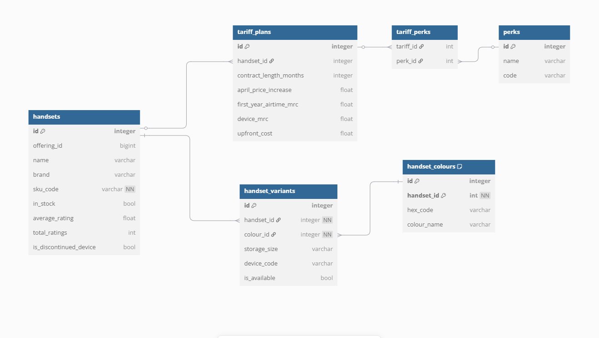
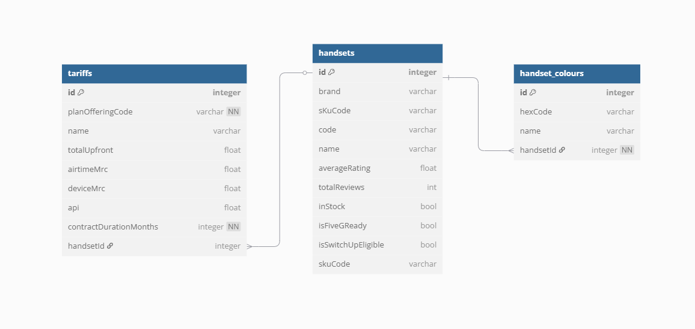

# 15gifts_task
15Gifts technical task

## Running the project

To run the project on Docker, simply run in the root of the project:
```
docker build -t o2-product-set-cb .
docker run --rm o2-product-set-cb 
```

The docker image will then extract, transform and load the data into a Sqlite3 file, representative of a relational database. 

If you wish to explore the dataset, please run the following:

```
docker run -it --rm o2-product-set-cb bash -c "apt-get update && apt-get install -y sqlite3 && bash"
# You'll now be in the container with the sqlite3 CLI installed
python main.py # initialise the database if not already...
sqlite3 o2-inventory.sqlite3
> SELECT * FROM handsets; # for example
```

## Discussion

Initially, looking into the project specifications, I thought that this dataset would be used as a downstream analytical model. My initial gut instinct at that point was to use OBT (one big table) and allow ELT operations via DBT to split out the upstream source into other data sources downstream.

As instead this is being used for a recommendation engine, the following analytical questions, from a prospective customer, would need to be handled by the database design:

* I would like a 5g ready phone that comes in blue
* Please list all the phones that come with unlimited data contracts
* Which deals come with Amazon Prime membership as a bolt-on?
* Compare the storage sizes of the iPhone 16 vs some other phone

These are not typical aggregation style questions but lend themselves more to fast lookups with `WHERE` or `JOIN` operations in a database. Because of this, I opted for a (admittedly stubby) relational database model called the product variants model.

Below was my initial ERD plan for the product data provided:



The following is a reduced model intending to show the merits of the product variant model, with one attribute



The benefit of this model is that a lot of referential validity is maintained by the database itself, via foreign-key/primary-key relations, and abstracting attributes of handset devices to their own tables enables very fast joins via the id columns, as well as fast `WHERE` clauses with a sufficient indexing strategy. It is also relatively easy to add more attributes, as these will just be new tables with a new FK/PK association.

For a production environment implementation the following comes to mind:

* Introducing a dead letter queue, that would load invalid records to a separate source (an S3 Bucket perhaps) for re-ingestion after analysis and cleaning (this also allows some feedback to the providers of the data on the integrity of the data itself)

* Testing - I realise I haven't done any unit/integration tests here, whilst I was validating my work locally on an interactive python shell, I would't dream of doing this if it wasn't an MVP under time constraint.

* CI/CD - the same as above, tests and linting and data quality tests being automated on github runners would speed up feedback loops and ease nerves about pushing new versions to production.

* Further attributes - I limited the scope to just colour as an example of how the design would work, but there are obviously a lot more attributes a customer would want - storage, camera specs, the minutes/data/calls on the tariffs. I do have a separate branch on this repo trying to implement a bridge table to enable extras, but I sadly cut it loose due to time.

* Further transformation - For example, colours are not generically named in the same way a customer would ask, there is scope here to add a hexcode <-> generic_colour name map to better lookup people asking for "white" phones instead of "titanium ivory".

In terms of scaleability, this implementation is fairly strong due to the relational integrity and indexeable strategy. This is only under the assumption that the production database for the recommendation engine is relational. If the production database was a columnar database, the multiple joins to reach each attribute would be far more costly and it may be more valuable to change to a design that minimises joins such as OBT or even the EAV model (since migrating databases is expensive in both time and money).


